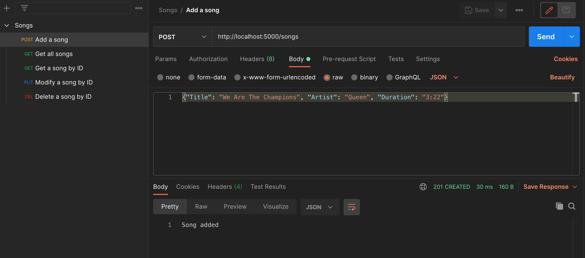

# Flask - PostgreSQL - Docker 

## What's in the box? 
Here is a vanilla Dockerized Flask web application offering CRUD operations on a PostgreSQL database.

## Requirements
* Docker https://www.docker.com
* Git https://git-scm.com (optional: useful for getting this repo)
* Postman https://www.postman.com 

## How to run? 
1. Open your terminal and go where you'd like to clone this repository  
`$ cd /path/to/clone/repo`

2. Get this repository and go to the root project directory  
`$ git clone https://github.com/melvin-lm/flask_postgresql_docker && cd flask_postgresql_docker`

3. From this directory (where the docker-compose.yml file is), run the command  
`$ docker-compose up -d --build`

You're all done!

## How to see it works?
At first run, the database is empty  
Go to `http://localhost:5000/songs`

The simplest way to add data to the database is using Postman  

## How to stop the containers?
If you want to keep what's in the database for future use, from the root project directory (it will stop and delete the containers)  
`$ docker-compose down`

If you want to clear the database, use -v option to delete volumes  
`$ docker-compose down -v`
